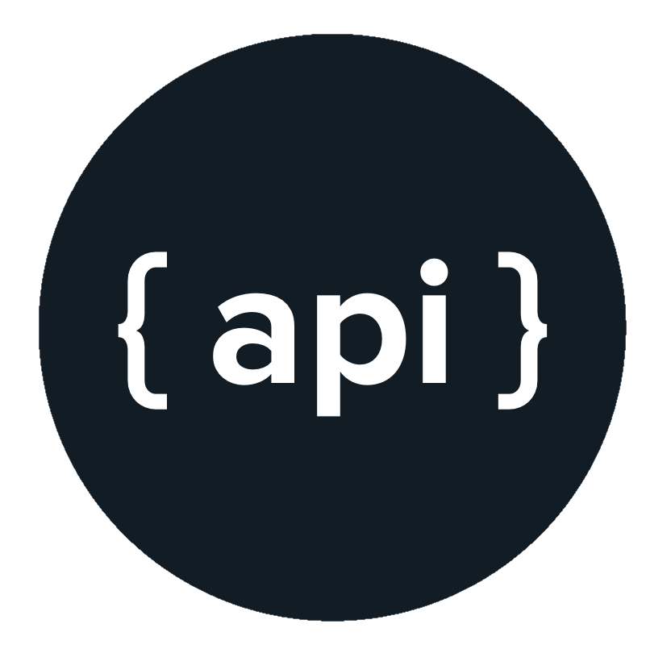
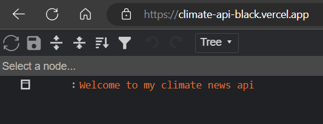
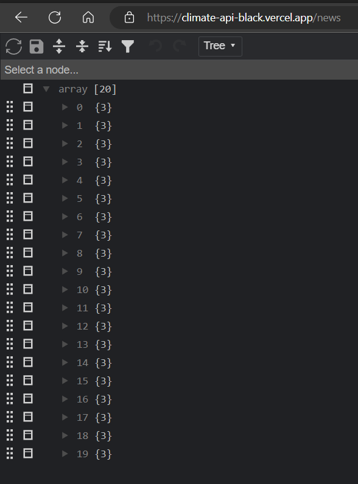
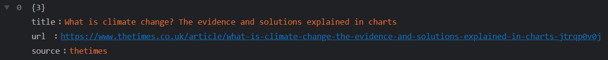
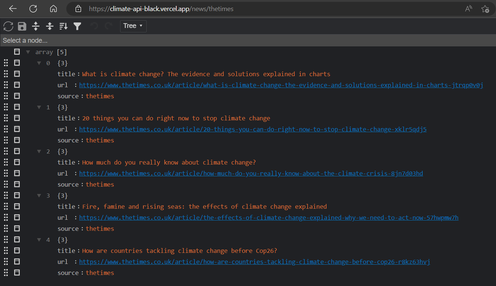

# **OPEN API**

## **Overview**
-----------------------------------------
Open Source is everywhere, why not in API? 
Open API is a free API platform where people can interact with the news API.
It's a simple node.js application deployed on vercel that returns json reponse based upon particular route/endpoints. Based upon the JSON data people can 
make really cool project and use it in their full-stack application.

------------------------------------------
## **How to use it?**
------------------------------------------
`Step - 1`
> Go to : https://climate-api-black.vercel.app/

- **You will able to see the following page👇🏻**

`Step - 2`
> base-url = https://climate-api-black.vercel.app/

**Hit an endpoint, in this case it's `news`**

> Go to : base-url/news

- **You will able to see the following page👇🏻**

- In each response you will able to see 3 params

>> - **title**
>> - **url**
>> - **source** 

`Step - 3`
> Go to : base-url/news/source

- **You will able to see the following page👇🏻**

It contains all the reponses filtering out only for "particular newspaper"

## Don't forget to ⭐ the repo, it encourages me to make more open source projects for communities.